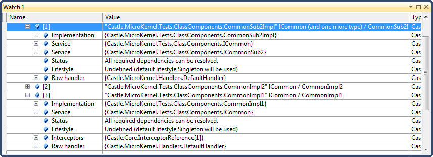

# 调试视图

为了更容易的深入了解容器内正在发生的事情，并让你关注潜在问题，Windsor 在容器的顶部，提供了可定制的，动态的调试器视图。

为了访问它们，在容器的有效范围内的代码上放置一个断点，并使用内置的 Visual Studio 窗口（像本地或监视窗口）查看容器。你可以通过在断点命中的时候点击容器，并从上下文菜单中选择“添加监视”来实现。

:information_source: **在 Silverlight 中不可用** 由于 Silverlight 的限制（目前似乎还没有对调试器代理的支持），该功能只能在 .NET 版本的 Windsor 中使用。


随着 2.5.1 版本，Windsor 在使用 Visual Studio 调试器查看容器的时候，给出了以下列表的四项。

## All components

顾名思义，该选项提供注册到容器的所有组件。


对于每个组件，可以看到的信息有以下格式：

```
"组件在容器中的唯一名称" 服务类型 (可选的其它服务的数量) / 可选的实现类型
```

### 唯一名称

第一个元素 - 名称是 Windsor 标识组件的唯一键。如果使用 Fluent API 的 `Named()` 方法为组件指定名称，或者使用 `id` 属性从 XML 注册组件，那么就是它了。如果不显式设置名称（大多数时候是这样），Windsor 将自己分配一个值（多数时候是实现类的名称，但不是必须如此，因此**不要依赖这个**）。

### 服务类型

服务类型是组件公开的服务的类型，是该级别上可用的最重要的信息片段。如果组件公开多个服务，其中一个会在该级别上显示，以及公开了多少个其它服务（比如，上面屏幕截图中的第二个组件）

### 实现类型

大多数情况下，组件的实现类型将会显示在 `/` 后面，作为信息的最后一部分。如果组件的服务是实现类型，那么就不会显示（比如，公开类自身而不是其实现的接口或其基类）。如果没有实现类型，比如上图的第一个组件， `TwoInterfacesImpl` 这时既是实现类型也是服务类型。

:information_source: **晚期绑定类型：** 如果你看到了上图的最后一个组件，将会注意到它的实现类型为 “late bound type” （晚期绑定类型）。意思是该组件很可能通过工厂创建，比如 `UsingFactoryMethod` 方法。Windsor 不能静态确定实际的实现类型。

## 组件视图

当展开列表中的任何一个组件时，将可能看到类似下面所示的视图：



每个组件之间的元素的确切列表可能不同，但是包含如下元素：

* 实现（Implementation ）类型
* 组件公开的服务（Service）类型（全部）
* 状态（Status）（Windsor 的静态解析是否能够找到创建组件实例所需的所有依赖）（下面详细讨论）
* 组件的生命期类型（Lifestyle）
* 拦截器列表（Interceptors）（如果有的话，否则不会显示）
* Raw 处理器（handler） （允许访问组件的底层信息）

## 潜在的错误配置的组件（Potentially Misconfigured Components）

潜在的错误配置的组件列表列出了 Windsor 认为错误配置的组件。也就是说组件需要一些依赖，但是 Windsor 不能静态确定是否能够提供那些依赖。

:warning: **不是 100% 正确：** 这仅是一个帮助其，Windsor 提供一个标志标明某些事情可能不正确。如果一个组件显示在该列表中，并不是说就不能被解析了。反之亦然。


如果想知道为什么 Windsor 认为一个组件是错误配置的，点开 `Status -> Message` 属性，并用文本可视化器打开。所提供的组件类看起来像这样……

```csharp
public class ClassWithArguments
{
    private readonly string arg1;
    private readonly int arg2;

    public ClassWithArguments(string arg1, int arg2)
    {
        this.arg1 = arg1;
        this.arg2 = arg2;
    }
}
```

...并且它的参数没有提供，Windsor 将会给你一个很好的说明，就像下面这样：


## 潜在生命期类型不匹配（Potential Lifestyle Mismatches）

经验法则是，活得短的组件应该引用活得长的组件，而不是其他方式。所以如果有一个单例（singleton）引用 per-web-request 组件，从而让它（per-web-request 组件）活得比 Web 请求的时间段更长，很可能有一个 bug。Windsor 检测像那样的依赖，并在潜在生命期类型不匹配列表中报告他们。目前检测以下依赖：

* 单例（singleton）依赖临时（transient）
* 单例（singleton）依赖 per-web-request

:warning: **不是 100% 精确：** 同样的，这是一个**潜在的**生命期类型不匹配，在某些罕见的情况下，这可能是一个有效的方案（特别是单例依赖临时）。

该列表以如下格式显示信息：

```
"依赖组件的唯一名称" »生命期类型« (直接（directly）/间接（indirectly）) 依赖（depends on） | "被依赖组件的唯一名称" »生命期类型«
```


展开 `Description` 属性的时候可以看到依赖链的全部描述。


:information_source: **间接依赖：** 注意上面的例子依赖顺序如下：`A (singleton) -> B (singleton) -> C (transient)` 因此 `A` 间接依赖 `C`，通过 `B`。 This is reflected in the list of components which shows how the dependency chain goes (top to bottom) as well as description message.

## 使用代码访问调试器信息

如果希望使用代码访问调试器信息 (比如，测试)，可以用这种方式获取潜在错误配置处理器。

```csharp
var host = (IDiagnosticsHost)container.Kernel.GetSubSystem(SubSystemConstants.DiagnosticsKey);
var diagnostics = host.GetDiagnostic<IPotentiallyMisconfiguredComponentsDiagnostic>();
var misconfiguredHandlers = diagnostics.Inspect();
```

可以使用 `IPotentialLifestyleMismatchesDiagnostic` 接口替换 `IPotentiallyMisconfiguredComponentsDiagnostic`。
