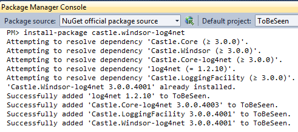
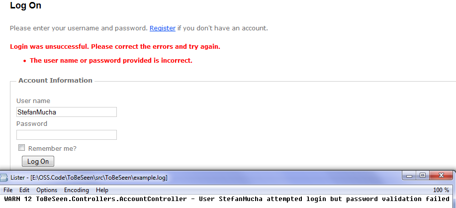

# Windsor 教程 - 第五部分 - 添加日志支持

## Introduction

现在基础设施已经到位，是时候开始为程序增加价值了。嗯 - 差不多。在应用前期应该考虑的一个是日志。我们使用 Windsor 帮助我们正确的配置日志。在这个部分你将看到如何使用 [设施](facilities.md) 来扩展 Windsor 外部支持。

## 日志设施

就像前面提到的那样，Windsor 有一些额外的，可选的设施，是 Windsor 外部功能的扩展。这里我们为应用添加 [日志设施](logging-facility.md)。

该设施为主流日志框架提供通用抽象，如 [log4net](http://logging.apache.org/log4net/index.html) 和 [NLog](http://nlog-project.org/) 以及内置 `Trace` 类的日志机制。这为你提供了一个通用抽象，用于在开始在程序上工作之后，改变日志框架。更重要的是，该设施为你的类提供了所需的正确的 `ILogger` 实例，不需要其他静态依赖，that is present in most applications not using Castle Windsor.

在开始之前我们需要添加需要的包。打开 NuGet 程序包管理器并输入：`Install-Package Castle.Windsor-log4net`

这将你为添加所有需要的依赖。



### 安装器

现在我们引用了正确的程序集，让我们创建一个安装器（我告诉过你我们将会有相当多安装器）来安装设施到应用程序。

:information_source: 确保你在 `Installers` 文件夹创建安装器，在 `ControllersInstaller` 旁边。当然在技术上这是不需要的，这是保持项目整洁的好主意。

```csharp
using Castle.Facilities.Logging;
using Castle.MicroKernel.Registration;
using Castle.MicroKernel.SubSystems.Configuration;
using Castle.Windsor;

public class LoggerInstaller : IWindsorInstaller
{
    public void Install(IWindsorContainer container, IConfigurationStore store)
    {
        container.AddFacility<LoggingFacility>(f => f.UseLog4Net());
    }
}
```

:information_source: 如果你没有看到 `UseLog4Net()` 方法，确保你正确引用了 `Castle.Facilities.Logging` 的完整配置版（不是客户端配置）。

注意API使用的模式。泛型参数指定了要添加设施的类型，然后使用 lambda 表达式配置设施（这个例子中告诉设施我们使用 log4net）。

我们没有指定 log4net 配置的位置，默认情况下设施将查找 `log4net.config` 文件，这是将 log4Net 配置与 castle 库分离的关键点。现在我们为项目添加一个配置文件（log4Net 配置）。它将包含标准 log4Net 配置，如下所示：

```xml
<?xml version="1.0" encoding="utf-8" ?>
<configuration>
  <log4net>

    <appender name="RollingFile" type="log4net.Appender.RollingFileAppender">
      <file value="error.log" />
      <appendToFile value="true" />
      <maximumFileSize value="100KB" />
      <maxSizeRollBackups value="2" />

      <layout type="log4net.Layout.PatternLayout">
        <conversionPattern value="%level %thread %logger - %message%newline" />
      </layout>
    </appender>

    <root>
      <level value="DEBUG" />
      <appender-ref ref="RollingFile" />
    </root>
  </log4net>
</configuration>
```

你需要修改 LoggerInstaller 来添加

```csharp
[assembly: XmlConfigurator(Watch = true)]
public class LoggerInstaller : IWindsorInstaller
{
    public void Install(IWindsorContainer container, IConfigurationStore store)
    {
        log4net.Config.XmlConfigurator.Configure();
        container.AddFacility<LoggingFacility>(f => f.UseLog4Net());
    }
}
```

log4net 文档详细的解释了该文件每个元素的内容，这里我们不做讨论。

### 我们需要做什么？

“这该怎么使用？”，你可能会问。你需要做的仅仅是请求一个 `Castle.Core` 程序集中 `Castle.Core.Logging` 命名空间下的 `ILogger` 接口的引用，（通常的做法是使用可设置属性而不是构造函数）这样就行了。容器将会提供给你一个已配置，可以使用的 `ILogger` 实例。要实际看到这个，我们为 `AccountController` 添加一个警告日志记录，当用户试图使用错误密码登陆的时候。

```csharp
public class AccountController : Controller
{
	// this is Castle.Core.Logging.ILogger, not log4net.Core.ILogger
	public ILogger Logger { get; set; }

	[HttpPost]
	public ActionResult LogOn(LogOnModel model, string returnUrl)
	{
		if (ModelState.IsValid)
		{
			if (MembershipService.ValidateUser(model.UserName, model.Password))
			{
				//Removed for brevity
			}
			else
			{
				Logger.WarnFormat("User {0} attempted login but password validation failed", model.UserName);
				ModelState.AddModelError("", "The user name or password provided is incorrect.");
			}
		}

		// If we got this far, something failed, redisplay form
		return View(model);
	}
}
```

现在使用错误证书登陆将会产生日志记录，只要 log4net 配置是正确的。



## 总结

最后，要记得 `ILogger` 接口可能在你使用的日志框架中存在（这个例子中使用 log4Net）。需要额外注意的是，我们使用包含在 `Castle.Core` 程序集的 `Castle.Core.Logging` 命名空间中的 `ILogger` 接口。

继续 [Windsor 教程 - 第六部分 - 持久化层](mvc-tutorial-part-6-persistence-layer.md).
