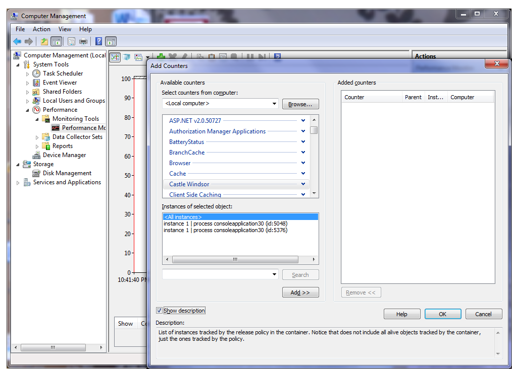
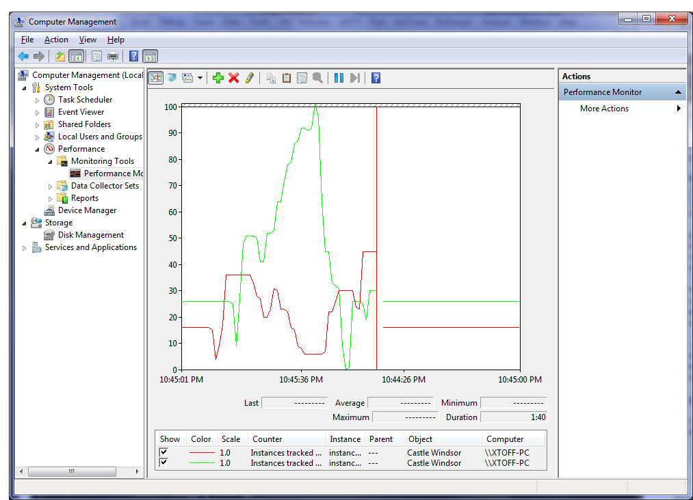

# 性能计数器

Windsor 3 引入了 Windows 性能计数器的支持。

现在 Windsor 只提供了一个计数器 - “通过释放策略跟踪的对象（Objects tracked by release policy）”，显示了指定容器通过释放策略跟踪的对象的总数量。

:information_source: **寻找内存泄露：** 这是一个非常有用的特性，能够帮助快速确定是否有未释放被跟踪组件实例的问题。

## 使用计数器

该特性默认没有开启。下面的代码演示了如何启用计数器：

```csharp
var container = new WindsorContainer();
var diagnostic = LifecycledComponentsReleasePolicy.GetTrackedComponentsDiagnostic(container.Kernel);
var counter = LifecycledComponentsReleasePolicy.GetTrackedComponentsPerformanceCounter(new PerformanceMetricsFactory());
container.Kernel.ReleasePolicy = new LifecycledComponentsReleasePolicy(diagnostic, counter);
```

Windsor 将会检查其是否有必须的权限，如果有，Windsor 将会确保正确的策略和创建计数器，并在程序运行时更新计数器。

为了看到计数器的数据，打开性能监视器（Performance Monitor）（计算机管理的一部分，可以通过控制面板的管理工具区访问）。Then click Add (Ctrl+N) and find "Castle Windsor" section. As noted above it will contain just one counter - "Objects tracked by release policy", and list of its instances.

Windsor 性能监视器实例列表：



上图所示的例子中，有两个监视器的例子。它们来自同一个应用的不同实例。选择它们后，就可以跟踪每个容器所有被跟踪组件实例的总数量了。

每个容器被跟踪实例的列表：


