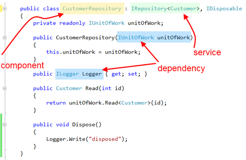

# 服务和组件

组件（components）, 服务（services） 和依赖（dependencies）:



和其他技术一样, Windsor 有一些基础概念你需要理解以便正确的使用它。不要害怕 - 他们可能有吓人复杂的名称和抽象的定义，但是掌握他们十分简单。 

## 服务

:information_source: **Windsor中的服务 和 WCF 服务:** 术语服务（service）的使用十分泛滥，这几年更是如此。服务在本文档中的使用比拿来举例的WCF服务还要广泛。

你将在本文档和Windor的API到处看到的第一个概念是 **服务**。实际的定义有点像这样：“*服务是一个描述一些整体功能单元的抽象契约*”。

现在，用通俗易懂的语言，让我们设想你进入一个咖啡厅，你从来没有去过。你向咖啡师，点了咖啡，付钱，等待和享受一杯完美的卡布奇诺。现在，让我们来看看你所经历的整个过程：

* 指定你想要的咖啡
* 付款
* 获得咖啡

地球上的每一个咖啡馆是几乎相同的。他们是咖啡店的服务。它开始做多一点，现在感觉？咖啡店有明确定义，它暴露了整体的功能 - 它制造咖啡。该契约是相当抽象的和高等级的。它不关注自身的“实施细节”;咖啡店有什么样的咖啡机和咖啡豆，多大，咖啡师的名字是什么，她的衬衣颜色。你作为一个用户不关心这些事情，你只在乎你的卡布其诺，所以所有不直接影响你获得你的咖啡的事情，不属于作为服务的一部分。

现在又回到 .NET 我们可以定义一个咖啡店为一个接口（因为接口定义抽象的，没有任何实现细节，你经常会发现，你的服务将被定义为接口）。

```csharp
public interface ICoffeeShop
{
   Future<Coffee> GetCoffee(CoffeeRequest request);
}
```

实际的细节显然可以改变，但它具有所有重要的方面。`ICoffeeShop`定义的服务是高等级的。它定义了所有成功订购咖啡所需要的方面，但它不泄漏关于谁、如何、哪里准备了咖啡的任何细节。

如果你不喜欢咖啡这个例子，你可以在你的代码库找到很好的契约例子。 ASP.NET MVC中的`IController`，定义了所有ASP.NET MVC框架将你的控制器成功地插入到其处理流水线所需的所有细节，但给你需要的所有灵活性去实现控制器，无论你正在构建一个社交网站或电子商务应用。

如果这一切都简单明了，现在，让我们继续下一个重要的概念。

## 组件

组件和服务有关。服务是一个抽象的术语，但我们处理具体，真实的世界。咖啡店作为一个概念不会制造你的咖啡。对此你需要一个这个概念落到实际的真实的咖啡店。在C＃而言，这通常意味着一个类实现该服务。

```csharp
public class Starbucks: ICoffeeShop
{
   public Future<Coffee> GetCoffee(CoffeeRequest request)
   {
      // some implementation
   }
}
```

到目前为止，一切都很好。现在需要记住的重要事情是，就像在镇上可以有一个以上的咖啡店，应用程序中可以有多个组件，由多个类实现（星巴克和CofeeClub为例）。

这还没完！如果镇上可以有一个以上的星巴克，那么也可以是由相同的类支持一个以上的组件。如果你使用过NHibernate，在一个应用程序中访问多个数据库，你可能有两个会话工厂，每个数据库一个。它们都是由同一个类实现的，它们都提供了相同的服务，但它们是两个独立的组件（具有不同的连接字符串，它们映射不同的类，或一个连接到Oracle，而另一个到SQL Server）。

这还没有结束（仍然）！谁说，当地的法国咖啡馆只能卖咖啡？果馅饼或新鲜面包与咖啡搭配怎么样？就像在现实生活中的一个咖啡厅可以用于其他目的一样，单一组件可以暴露多个服务。

在继续之前还有一件事。虽然到目前为止并没有明确提到，但对你它可能是非常明显的，一个组件提供一个服务（或几个）。在您的应用程序中，按照其身份，所有类都不会真正提供任何服务，也不会在您的容器中作为组件。领域模型类，数据传输对象，只是你不会放在容器中的几个例子。

## 依赖

要获得完整的印象，我们需要先谈一谈相关性。

一个组件工作来完成它的服务不是空谈。就像一个咖啡店依赖于公用事业公司（电力）提供的服务、他的供应商（以得到豆类，牛奶等），大多数组件将最终委托它们的非必须方面给其他组件。

现在让我重复一件事只是为了确保它是显而易见的。组件依赖于其他组件的服务。这可以很好地分离的代码，就像咖啡店并不关心送奶工工作的细节。

除了依赖其他组件的服务，您的组件也有时会用的东西并不属于组件本身。比如连接字符串，服务器名称，超时值和其他配置参数不属于服务（如我们前面所讨论的），但是是组件的有效（共同）依赖。

在C＃中的组件将那些它需要的依赖定义为构造函数参数或可设置的属性。在某些更高级的情景下组件的依赖和你作为实现的类并没有什么关系（记住，组件的概念与那些作为它们的实现的类是不一样的），例如，当你使用拦截器的时候。这很先进但是如果你刚刚起步，就不必考虑这些。（待定翻译）

## 综述

所以，现在让我们把它放在一起。为了有效地使用容器，我们使用的细粒度组件，暴露细粒度，良好定义的，抽象的服务，其他组件提供的依赖服务，和某些配置值，以满足他们的服务契约。（待定翻译）

你最终会有许多小的，分离的组件，这将让你在限制变化的范围下迅速改变和演变您的应用程序，但缺点是你最终会有大量必须有人有管理多重依赖的小类。

那是容器的工作。